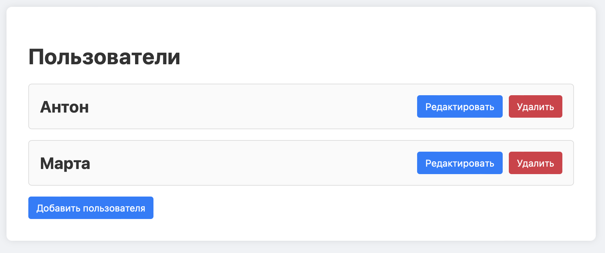
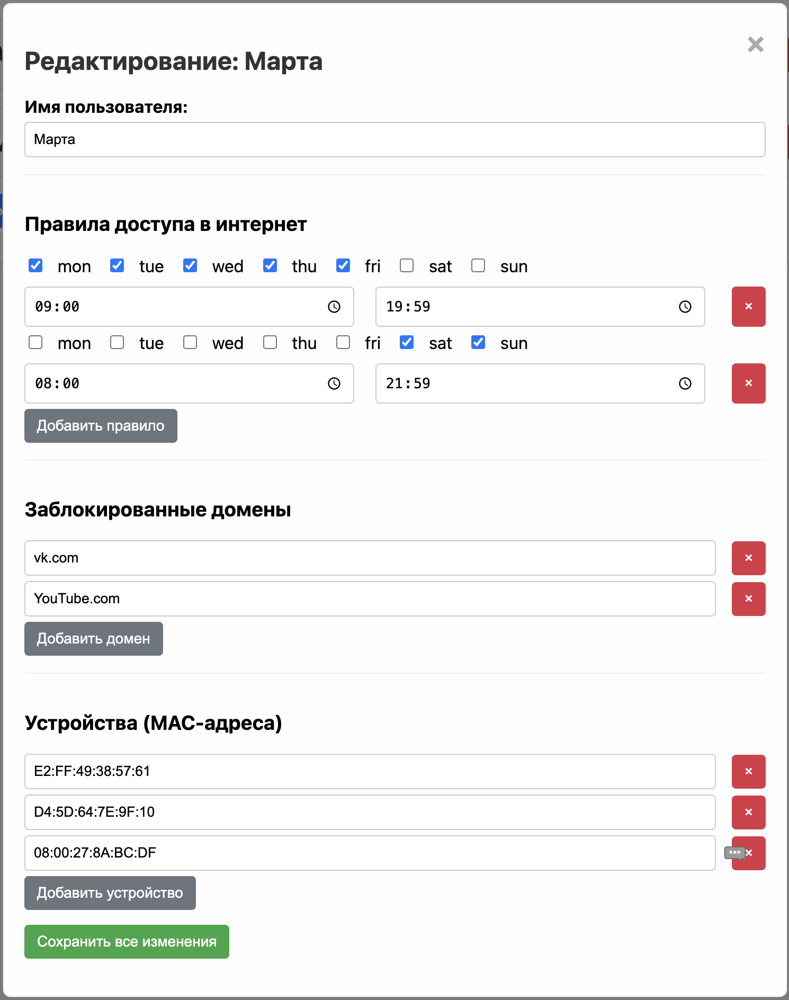

# Скрипт родительского контроля для OpenWRT

Решение для родительского контроля на роутерах с прошивкой OpenWRT. Защитите ваших детей и управляйте доступом в интернет с легкостью!

Скрипт предоставляет:
- **DNS-фильтрацию нежелательного контента:** Блокируйте доступ к опасным или неприемлемым сайтам.
- **Гибкое управление устройствами сети:** Легко добавляйте, удаляйте и настраивайте правила для всех подключенных устройств.
- **Индивидуальные профили для разных пользователей:** Создавайте уникальные настройки для каждого пользователя.
- **Раздельный контроль доступа по расписанию:** Устанавливайте индивидуальные графики доступа в интернет для каждого устройства или пользователя.

> ⚠️ Для работы требуется предустановленный и настроенный **AdGuard Home** (DNS-фильтрация)

## Установка

Для установки родительского контроля выполните следующую команду в терминале вашего роутера OpenWRT. Она загрузит и запустит установочный скрипт, который поможет вам настроить систему контроля.

```bash
sh -c "$(wget -qO - https://raw.githubusercontent.com/karkaradon/parental-control/main/install.sh)"
```

## Доступ к Веб-интерфейсу

После успешной установки и завершения работы скрипта, пожалуйста, изучите его вывод. Если ошибок нет, вы сможете получить доступ к веб-интерфейсу скрипта родительского контроля по следующему адресу:
```
http://ваш-ip-роутера/pctl
```

Замените ваш-ip-роутера на реальный IP-адрес вашего роутера OpenWRT (например, http://192.168.1.1/pctl).
## Демонстрация интерфейса

| Главное меню | Настройка расписания |
|--------------|-----------------------|
|  |  |